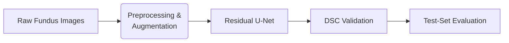

# Retinal Hard Exudate Segmentation with MONAI

This project implements a deep learning pipeline for segmenting hard exudates (pathological lipid deposits) in retinal fundus images. Built with MONAI, it features a residual U-Net architecture trained with medical imaging-specific augmentations and a class-weighted loss function to address foreground sparsity.

## Key Features
- 🩺 **Medical Imaging Preprocessing**:  
  - Channel-first normalization  
  - Intensity scaling (0–1)  
  - Binary mask thresholding  
- 🔁 **Domain-Specific Augmentations**:  
  - 90° rotations, flips, zooms  
  - Gaussian noise, contrast adjustments  
- 🧠 **Residual U-Net Architecture**:  
  - Batch normalization  
  - 4 residual blocks per stage  
  - Class-weighted Dice-CE loss  
- 📊 **Quantitative Evaluation**:  
  - Dice Similarity Coefficient (DSC)  
  - Validation-based checkpointing  
  - Qualitative overlays  

## Pipeline Overview

Installation
Clone repository:

bash
git clone https://github.com/yourusername/retinal-exudate-segmentation.git
cd retinal-exudate-segmentation
Install dependencies:

bash
pip install -r requirements.txt

2. Prepare Dataset Structure
Create this exact folder structure in your repository root:
hard_exudate/
├── images_hard_exudate/
│   ├── image_001.jpg
│   ├── image_002.jpg
│   └── ... (all your fundus images)
└── masks_hard_exudate/
    ├── image_001.png
    ├── image_002.png
    └── ... (corresponding binary masks)
